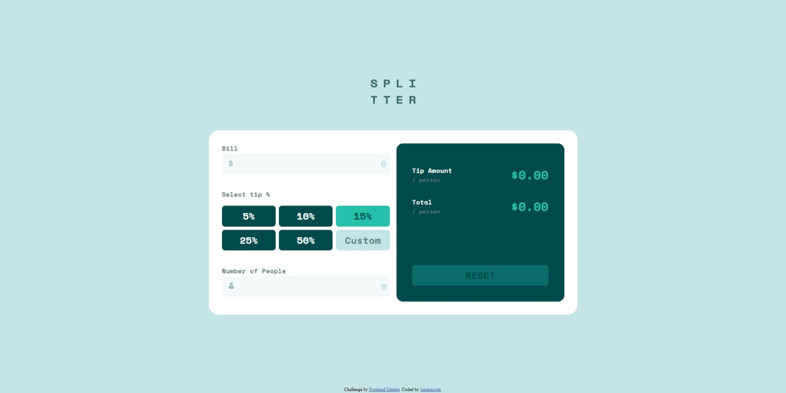
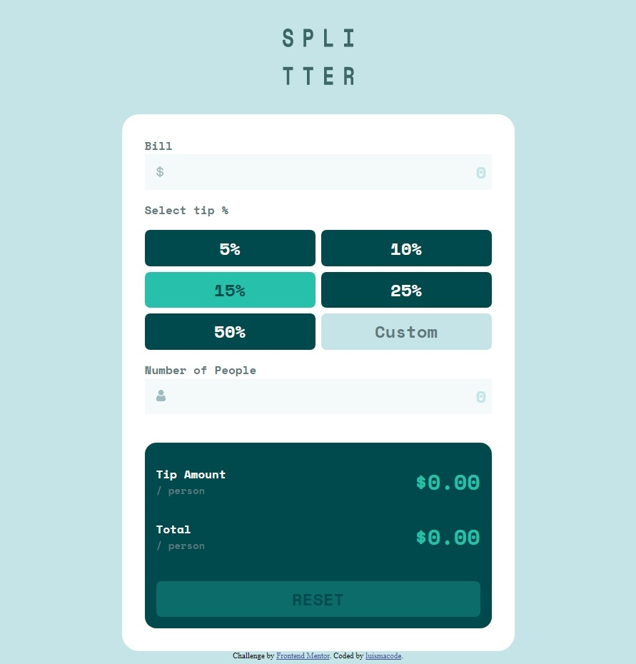
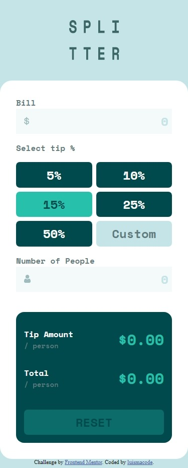

# Frontend Mentor - Tip calculator app solution

This is a solution to the [Tip calculator app challenge on Frontend Mentor](https://www.frontendmentor.io/challenges/tip-calculator-app-ugJNGbJUX). Frontend Mentor challenges help you improve your coding skills by building realistic projects.

## Table of contents

- [Overview](#overview)
  - [The challenge](#the-challenge)
  - [Screenshot](#screenshot)
  - [Links](#links)
- [My process](#my-process)
  - [Built with](#built-with)
  - [What I learned](#what-i-learned)
  - [Continued development](#continued-development)
  - [Useful resources](#useful-resources)
- [Author](#author)
- [Acknowledgments](#acknowledgments)

## Overview

### The challenge

Users should be able to:

- View the optimal layout for the app depending on their device's screen size
- See hover states for all interactive elements on the page
- Calculate the correct tip and total cost of the bill per person

### Screenshot





### Links

- Solution URL: [solution](https://www.frontendmentor.io/solutions/tipcalculatorappmain-l6s_AyOQWt)
- Live Site URL: [live site](https://luismacode.github.io/tip-calculator-app-main/)

## My process

### Built with

- Semantic HTML5 markup
- CSS custom properties
- Flexbox
- CSS Grid
- Mobile-first workflow
- javascript modules
- BEM Naming

### What I learned

Through the development of this challenge I learned:

- Use setCurrency function for convert from number to US currency format

```js
   const setCurrency = (currency) => {
    return currency.toLocaleString("en-US", {
    style: "currency",
    currency: "USD",
    } );
  };
  ```

- Use this code snippet for remove the percentage symbol of the tip field and convert  to number.

```js
  const getTip = (tip) => {
    return Number(tip.slice(0, -1)) / 100;
  };
```

- I use this code snippet to reset styles that were added when an error occurs or when the value of the fields has been validated.

```js
  function resetStyles(...inputs) {
    inputs.forEach((input) => {
      input.style = "border:none";
  });
}
```

- I use this code snippet to reset values of the fields and and disable the reset button again.

```js
  function resetValues(reset, ...inputs) {
    reset.setAttribute("disabled", "");
    nodes.forEach((input) => {
      input.value = "";
    });
  }
```

- I Use this small code to add and remove css class when you click an option button.

```js
  options.forEach((opt) => {
    option.addEventListener("click", (e) => {
      options.forEach((option) => {
        option.classList.remove("button-option--selected");
      });
    opttion.classList.add("button-option--selected");
  }
```

### Continued development

Although this small project is functional in my opinion there is always something to improve so as you learn new more efficient ways of doing things I will update the parts of code that could be improved.

### Useful resources

- [to-locale-string](https://developer.mozilla.org/en-US/docs/Web/JavaScript/Reference/Global_Objects/Number/toLocaleString)
- [for-each-js](https://developer.mozilla.org/en-US/docs/Web/JavaScript/Reference/Global_Objects/Array/forEach)
- [slice-js](https://developer.mozilla.org/en-US/docs/Web/JavaScript/Reference/Global_Objects/String/slice)

## Author

- Linkedin - [luismachaca](https://www.linkedin.com/in/luismachaca)
- Frontend Mentor - [@luismacode](https://www.frontendmentor.io/profile/luismacode)
- Twitter - [@luismacode](https://www.twitter.com/luismacode)

## Acknowledgments

I want to thank the channel called [CodingTube](https://www.youtube.com/watch?v=89TcBf7_s8o) since it served as a guide to facilitate the process of solving this challenge as well as to learn other way to face this challenge and enrich my learning.
